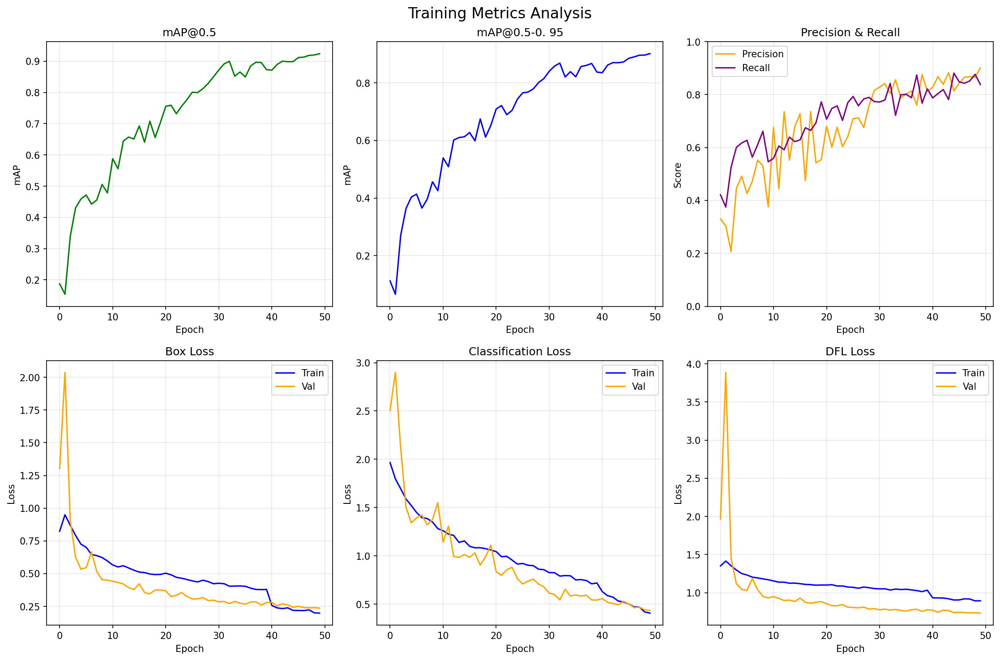

# ♻️ Recycling Object Detection


A deep learning-based system for detecting and classifying recyclable materials in images and video streams. Built with **YOLOv8** for object detection and **FastAPI** for the web interface and REST API.

## Features

- **Real-time Detection** - Detect recyclable objects in images and webcam streams
- **Web Interface** - User-friendly drag-and-drop interface for image upload
- **REST API** - Full-featured API for integration with other applications
- **Webcam Support** - Live detection using your device's camera
- **Fast Inference** - Optimized for speed with configurable inference size

## Detected Classes

The model can detect various recyclable materials including:
- Plastic bottles
- Glass bottles
- Aluminum cans
- Cardboard
- Paper
- And more...

---

## Overview

This project uses **YOLOv8** for detecting recyclable objects in images and video streams.

### Dataset
- **TrashNet** from Roboflow
- Link: https://universe.roboflow.com/nguyen-tuan-anh/trashnet-q8b5e

### Model
- **YOLOv8** (You Only Look Once v8) by Ultralytics
- Pre-trained and fine-tuned on TrashNet dataset

### Training Results


### Model Performance

```yaml
metrics:
  precision: 0.5072
  recall: 0.6562
  mAP50: 0.5944
  mAP50-95: 0.5695
```

---

## Quick Start

1. **Install Python 3.8 or higher**

2. **Install dependencies:**
```bash
pip install -r requirements.txt
```

3. **Download Model:**

Model link: https://drive.google.com/file/d/1WO9gqODtNO_U2_7rDI7IbJRHl9DHW1fg/view?usp=sharing

Place the model file at: `models/teacher/best.pt`

---

## Web API & Interface

### Start the Web Server
```bash
python -m uvicorn src.api.main:app --host 127.0.0.1 --port 8000 --reload
```

Then open your browser to: **http://127.0.0.1:8000**

### Web Interface Features
- **Upload Mode**: Drag & drop or select an image file to detect recyclable objects
- **Webcam Mode**: Use your webcam for real-time capture and detection

### API Endpoints

| Endpoint | Method | Description |
|----------|--------|-------------|
| `/` | GET | Web interface |
| `/api/v1/detect` | POST | Detect objects from base64 image |
| `/api/v1/detect/upload` | POST | Detect objects from uploaded file |
| `/api/v1/detect/batch` | POST | Process multiple images |
| `/api/v1/models` | GET | List available models |
| `/api/v1/health` | GET | Health check |
| `/api/v1/stats` | GET | Detection statistics |
| `/ws/detect` | WebSocket | Real-time detection stream |

### API Examples

**Detect from Base64 Image:**
```bash
curl -X POST "http://localhost:8000/api/v1/detect" \
  -H "Content-Type: application/json" \
  -d '{"image": "data:image/jpeg;base64,/9j/4AAQ..."}'
```

**Upload Image File:**
```bash
curl -X POST "http://localhost:8000/api/v1/detect/upload" \
  -F "file=@your_image.jpg"
```

**Response Format:**
```json
{
  "detections": [
    {
      "class_name": "plastic_bottle",
      "confidence": 0.85,
      "class_id": 0,
      "bbox": [148.5, 60.7, 274.6, 216.8]
    }
  ],
  "annotated_image": "data:image/jpeg;base64,...",
  "image_size": "512x384",
  "model_used": "teacher",
  "inference_time": 0.234
}
```

---

## Command Line Tools

### Webcam Detection
```bash
python src/inference/webcam_demo.py
```

### Image Detection
```bash
# Edit IMAGE_PATH in the file, then run:
python src/inference/image_processor.py
```

---

## Project Structure
```
Recycling/
├── models/
│   └── teacher/
│       └── best.pt          # YOLO model weights
├── notebooks/
│   ├── data_and_train.ipynb # Data preparation and training notebook
│   └── model_eval.ipynb     # Model evaluation notebook
├── src/
│   ├── api/
│   │   ├── main.py          # FastAPI application
│   │   ├── routes.py        # API endpoints
│   │   ├── schemas.py       # Pydantic models
│   │   └── utils.py         # Utility functions
│   ├── inference/
│   │   ├── detector.py      # Detection class
│   │   ├── webcam_demo.py   # Webcam script
│   │   └── image_processor.py
│   └── training/
│       ├── __init__.py      # Package initializer
│       ├── data_prep.py     # Data preparation utilities
│       └── train_teacher.py # Teacher model training script
├── web/
│   ├── static/
│   │   ├── css/style.css
│   │   └── js/app.js
│   └── templates/
│       └── index.html
├── requirements.txt
└── README.md
```

---

## Keyboard Controls (Desktop Apps)
- **q** - Quit
- **s** - Save frame
- **p** - Pause/Resume (webcam only)
- **f** - Fullscreen toggle

---

## Troubleshooting

**ImportError: No module named 'ultralytics'**
```bash
pip install ultralytics
```

**ImportError: No module named 'fastapi'**
```bash
pip install fastapi uvicorn python-multipart
```

**Can't find model file:**
- Make sure `best.pt` is in `models/teacher/` folder
- Or update the model path in `src/api/routes.py`

**Port 8000 already in use:**
```bash
python -m uvicorn src.api.main:app --port 8001
```

**CORS errors in browser:**
- The API should be accessed from the same origin (localhost:8000)
- For external access, add CORS middleware to FastAPI
